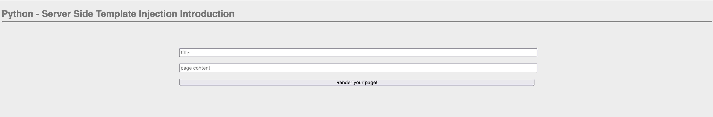

🔖 Challenge Info

    Challenge Name: Python - Server-side Template Injection Introduction

    Category: Web Exploitation

    CTF Platform: root-me

    Date Solved: 2025-05-07

📜 Challenge Description

    This service allows you to generate a web page. Use it to read the flag!
    
    

🔍 Recon & Exploitation Steps

    🔹 Finding Injection Points

        First, I tried to find my entry point that I could use for my injection.
        That was pretty easy. I knew that this challenge uses a Python template engine, so I simply typed this: {{7*7}} in the title and page content,
        and it gave me this:
        
        

    🔹 Successful Injection

        After that, I confirmed that my entry point is the "Page Content" input field.
        I tried to test some payloads.
        First, I tried this one:
            ❌ {{config.__class__.__init__.__globals__['os'].popen('ls').read()}}
        It didn't work and gave me this error:
        
             

        Then I tried this payload:
            ✅ {{ self.__init__.__globals__.__builtins__.__import__('os').popen('ls').read() }}
        And it worked! I found this:
        
             
        After that, I tried to run this payload to get more info about each file:
            ✅ {{ self.__init__.__globals__.__builtins__.__import__('os').popen('file *').read() }}
        It gave me this:
        
             
        I tried to read every file I found, and I tried to see the content of every directory and the files inside them.
        I didn’t find anything that looked interesting, so I checked if there were any hidden files and I got this:
        
            
            
        The only thing that looked interesting to me was a hidden file named .passwd, so I tried to read the file with this payload:
            ✅ {{ self.__init__.__globals__.__builtins__.__import__('os').popen('cat .passwd').read()}}
        And I got this:
        
            

🏁 Flag

    Python_SST1_1s_co0l_4nd_mY_p4yl04ds_4r3_1ns4n3!!!

        
