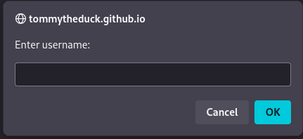
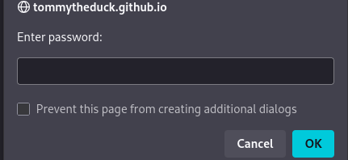
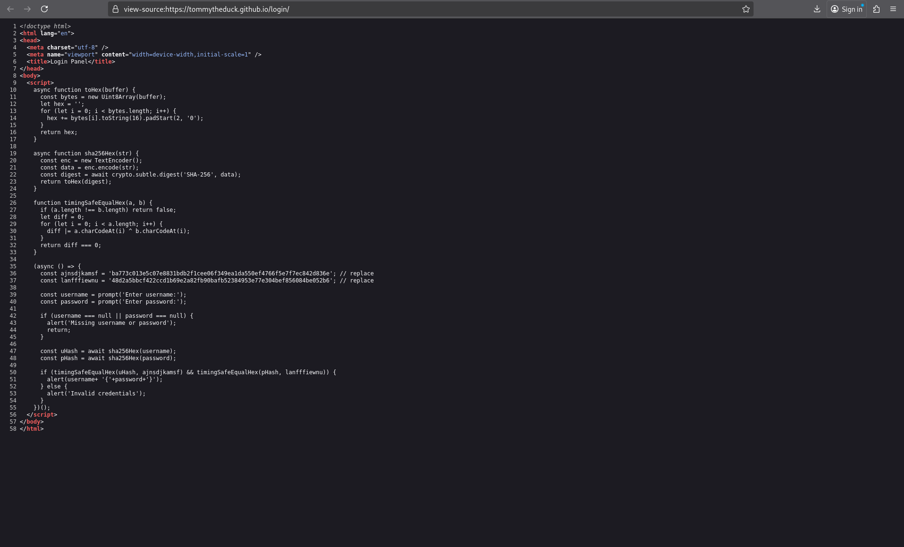
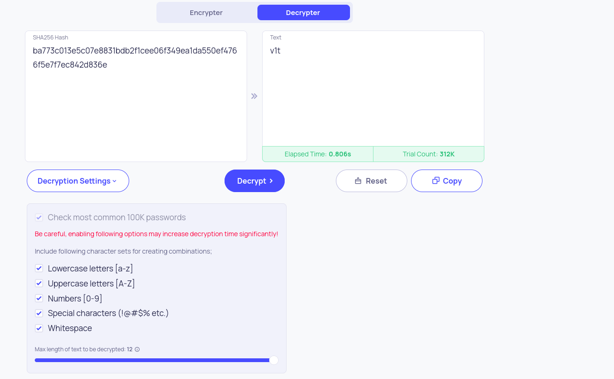
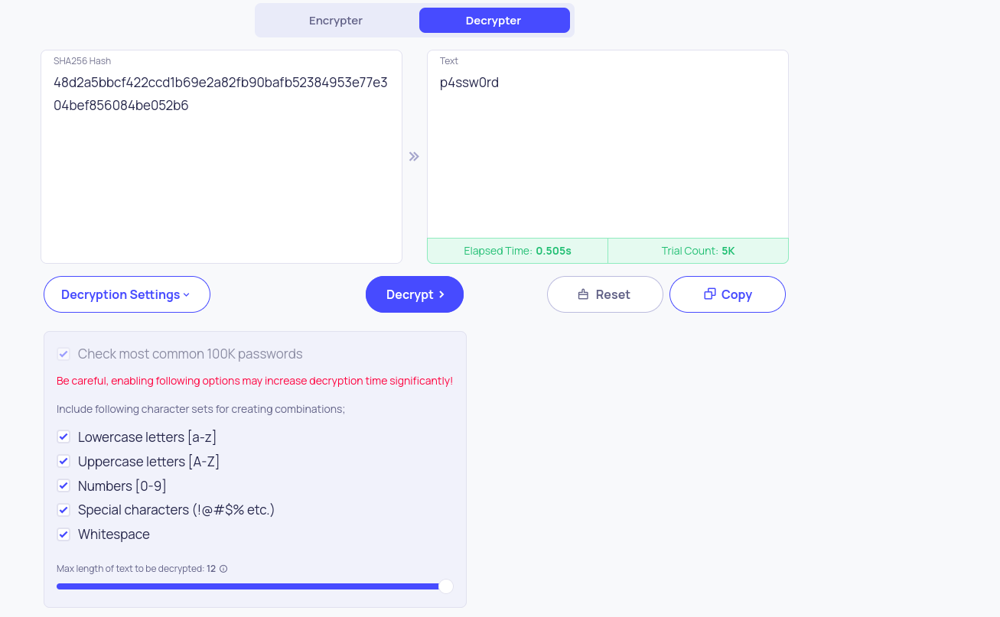

CTF: v1t CTF 2025
Category: Web
Points: 100
Challenge Description

A web-based login panel prompts for a username and password. The objective is to discover the correct credentials to obtain the flag.
Initial Reconnaissance

The login panel consists of two JavaScript prompts asking for username and password. Initial testing with admin:admin fails with an "Invalid credentials" message.

## Initial Interface

Examining the page source reveals the authentication mechanism is implemented entirely in client-side JavaScript, exposing the credential validation logic.
Analysis of the Source Code

## Source Code Analysis

The JavaScript code contains:

    Hashing Functions: SHA-256 hashing for both username and password

    Comparison Logic: Timing-safe comparison of hashes

    Hardcoded Hashes:

        Username hash: ba773c013e5c07e8831bdb2f1cee06f349ea1da550ef4766f5e7f7ec842d836e

        Password hash: 48d2a5bbcf422ccd1b69e2a82fb90bafb52384953e77e304bef856084be052b6

The successful authentication displays the flag in the format: username{password}
Exploitation

Since the SHA-256 hashes are exposed in client-side code, they can be reversed using rainbow tables or online cracking tools:

    Username hash ba773c013e5c07e8831bdb2f1cee06f349ea1da550ef4766f5e7f7ec842d836e = v1t

    Password hash 48d2a5bbcf422ccd1b69e2a82fb90bafb52384953e77e304bef856084be052b6 = p4ssw0rd

## Hash Cracking

Flag

Using the credentials v1t as username and p4ssw0rd as password successfully authenticates and reveals the flag.

Flag: v1t{p4ssw0rd}